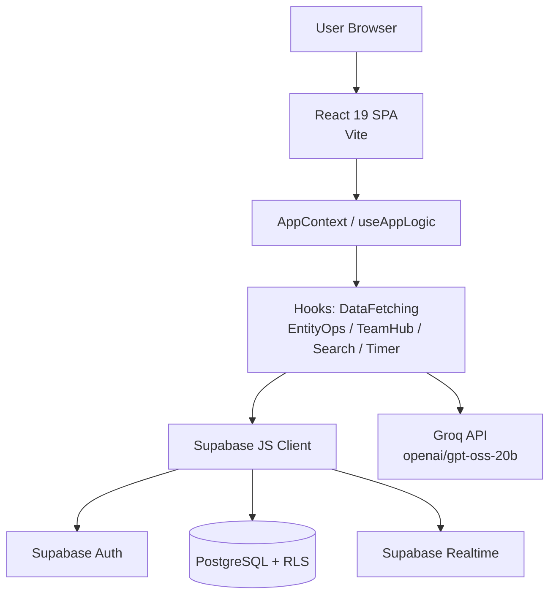
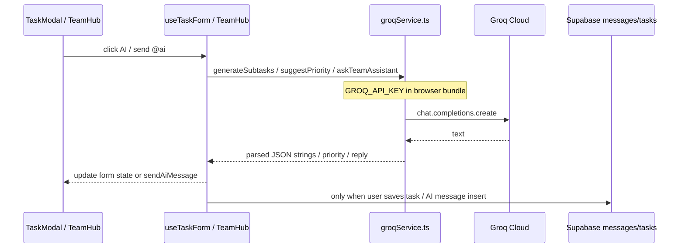
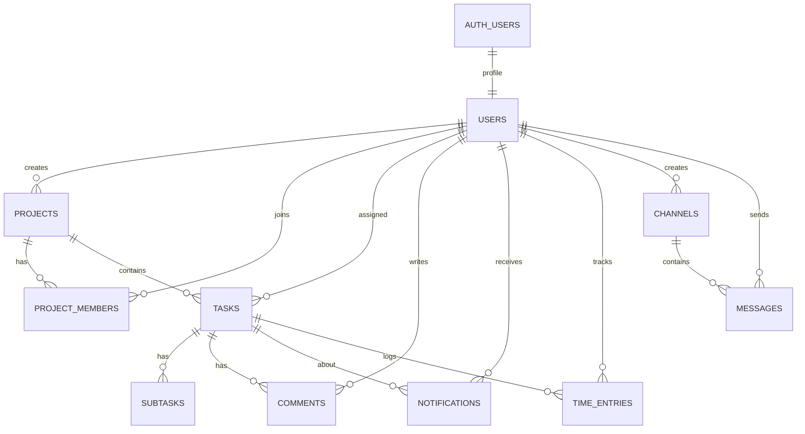

# SABTASK - SOURCE CODE ANALYSIS

> **Naming note:** Brief request titled the system "FastBoard". Repository evidence identifies the product as **SabTask** (`package.json` `"name": "sabtask"`, UI brand in `LoginScreen.tsx` / `Sidebar.tsx`). All findings below describe **SabTask** only. Do not invent FastBoard-specific features.

> **Analysis rules applied:** Source code is source of truth. Status values: `IMPLEMENTED` | `PARTIAL` | `NOT FOUND` | `TODO`. No secrets/API key values included.

---

## 0. Project overview

| Field | Value | Evidence |
|-------|-------|----------|
| Product name | SabTask | `package.json`, `README.md`, `LoginScreen.tsx` |
| Package name | `sabtask` | `package.json` |
| Version | `0.0.0` (private) | `package.json` |
| Type | SPA work/project management with Kanban-style task columns | `KanbanBoard.tsx`, `ViewManager.tsx`, `README.md` |
| Backend model | No custom app server; Supabase BaaS (Auth + PostgreSQL + Realtime client) | `supabaseClient.ts`, `supabase_schema.sql`; no `supabase/functions`, no Express/Flask/Nest |
| AI | Groq SDK from browser (`dangerouslyAllowBrowser: true`) | `groqService.ts`, `vite.config.ts` |
| Auth | Supabase Auth email/password | `useAppLogic.ts` `signInWithPassword` |
| Roles | System: `ADMIN` \| `MEMBER` | `enums` / `user_role` in schema; `utils/roles.ts` |
| Routing | No URL router; view switch via `activeTab` | `ViewManager.tsx`, `constants.ts` `NAV_CONFIG` |

**Problem solved (from product behavior in source):** Team task/project tracking with Kanban status columns, dashboard analytics, comments/subtasks, notifications, time tracking, and team chat — persisted in Supabase.

**Not found as product name:** FastBoard.

---

## 1. Project structure

```
sabtask/
├── package.json
├── vite.config.ts
├── tsconfig*.json
├── tailwind.config.js
├── eslint.config.js
├── .env.example
├── README.md, SETUP.md, TAI_KHOAN.md, CODE_OVERVIEW.md
├── PROJECT_REPORT_INFO.md
├── docs/RLS_MANUAL_CHECKLIST.md
├── scripts/seed-auth-users.mjs
└── src/
    ├── main.tsx
    ├── App.tsx
    ├── index.css
    ├── constants.ts
    ├── constants/demoUsers.ts
    ├── translations.ts
    ├── supabase_schema.sql
    ├── form_grants.sql
    ├── context/AppContext.tsx
    ├── services/
    │   ├── supabaseClient.ts
    │   └── groqService.ts
    ├── hooks/
    │   ├── useAppLogic.ts
    │   ├── useTaskForm.ts
    │   ├── useTeamHub.ts
    │   ├── useDashboardData.ts
    │   └── modules/
    │       ├── useDataFetching.ts
    │       ├── useEntityOperations.ts
    │       ├── useSearchSystem.ts
    │       ├── useTimeTracking.ts
    │       └── useUIState.ts
    ├── types/ (enums, models, props, ui, index)
    ├── utils/ (roles, timeAggregation + tests)
    └── components/
        ├── auth/LoginScreen.tsx
        ├── layout/ (Sidebar, Header, …)
        ├── views/ViewManager.tsx
        ├── modals/ModalManager.tsx
        ├── dashboard/, projects-view/, project-detail/, task-modal/, team-hub/, notifications/, ui/
        ├── KanbanBoard.tsx, Dashboard.tsx, ProjectsView.tsx, …
```

**Absent:**
- `supabase/` directory (migrations folder / Edge Functions) — **NOT FOUND**
- `src/pages/` — **NOT FOUND** (views are components + `ViewManager`)
- React Router config — **NOT FOUND**

---

## 2. Technology stack

Only technologies with package/source evidence:

| Technology | Version (from package.json) | Role in SabTask | Used by | Evidence | Example |
|------------|----------------------------|-----------------|---------|----------|---------|
| React | ^19.2.0 | UI library | Entire SPA | `package.json`, `main.tsx` | `createRoot(...).render(<App />)` |
| React DOM | ^19.2.0 | DOM renderer | `main.tsx` | `package.json` | — |
| TypeScript | ~5.9.3 | Static typing | All `.ts`/`.tsx` | `package.json`, `tsconfig*.json` | Domain in `types/models.ts` |
| Vite | ^7.2.4 | Dev/build tool; injects env | Build | `vite.config.ts` | `define: process.env.GROQ_API_KEY` |
| @vitejs/plugin-react | ^5.1.1 | React plugin | Vite | `vite.config.ts` | — |
| Tailwind CSS | ^4.1.18 | Utility CSS | Components | `package.json`, `@tailwindcss/vite` | Class names in `App.tsx` |
| @tailwindcss/vite | ^4.1.18 | Tailwind Vite plugin | `vite.config.ts` | — | — |
| @supabase/supabase-js | ^2.90.1 | Auth + DB + Realtime client | services/hooks | `supabaseClient.ts` | `createClient(url, anonKey)` |
| PostgreSQL (via Supabase) | Not pinned in npm; schema SQL | Primary datastore | Schema + queries | `supabase_schema.sql` | tables `users`, `tasks`, … |
| Supabase Auth | (SDK) | Email/password session | `useAppLogic.ts` | `signInWithPassword` | — |
| Supabase Realtime | (SDK) | Live notifications + chat | `useAppLogic.ts`, `useTeamHub.ts` | `postgres_changes` | — |
| Row Level Security | SQL policies | Authorization at DB | `supabase_schema.sql` | `enable row level security` | — |
| groq-sdk | ^1.6.0 | AI completions | `groqService.ts` | Model `openai/gpt-oss-20b` | `generateSubtasks` |
| lucide-react | ^0.562.0 | Icons | Many components | Sidebar, Kanban, … | `Kanban`, `LogOut` |
| recharts | ^3.6.0 | Charts | Dashboard charts | `StatusDonutChart.tsx`, `TaskTrendChart.tsx` | — |
| date-fns | ^4.1.0 | Date formatting | `useDashboardData.ts` | `format(date, …)` | — |
| clsx | ^2.1.0 | ClassName helper | UI utils | dependency | — |
| tailwind-merge | ^2.2.1 | Merge Tailwind classes | UI utils | dependency | — |
| ESLint + typescript-eslint | ^9 / ^8 | Lint | `eslint.config.js` | — | — |
| Vitest | ^3.2.4 | Unit tests | `*.test.ts` | `vite.config.ts` `test` | `roles.test.ts` |

**Checked and NOT FOUND in dependencies/source:**
- TanStack Query / React Query
- @dnd-kit
- React Router
- Chart libraries other than Recharts
- Form libraries (Formik/React Hook Form) — forms use local `useState`
- Zod/Yup validation libraries
- Toast libraries other than custom `Toast.tsx`
- Supabase Edge Functions
- Gemini (README structure comment mentions Gemini path historically; service file is `groqService.ts`; `geminiService.ts` deleted per git status)

---

## 3. Domain model

### Actual hierarchy (from schema + models)

```
User (public.users ↔ auth.users)
Project
  └── project_members (N-N User↔Project)
Task (belongs to Project; status ∈ TODO|IN_PROGRESS|REVIEW|DONE)
  ├── Subtask
  ├── Comment
  └── tags: text[] (array on task — not a Label entity)
Notification (per user; optional task_id)
TimeEntry (per user + task)
Channel (TEXT | VOICE)
  └── Message (optional attachment fields, is_ai)
```

**Kanban model:** There is **no** `boards` / `columns` table. Kanban columns are **task status enum values** rendered as UI columns (`KANBAN_COLUMNS` in `constants.ts`).

| Concept | Status | Evidence |
|---------|--------|----------|
| Project | IMPLEMENTED | `projects` table; `ProjectsView`, `useEntityOperations.handleProjectSave` |
| Board (separate entity) | NOT FOUND | No board table/type |
| Column/status | IMPLEMENTED (as `task_status`) | Enum + `KanbanBoard` |
| Task/Card | IMPLEMENTED | `tasks` + `Task` interface |
| Assignee | IMPLEMENTED | `assignee_id` on tasks/subtasks |
| Label (entity) | NOT FOUND | Only `tags text[]`; form saves `tags: []` always |
| Comment | IMPLEMENTED | `comments` table + Task modal |
| Activity/history table | NOT FOUND | `RecentActivity` = recent tasks UI only |
| Member | IMPLEMENTED | `users` + `project_members` |
| Role | IMPLEMENTED | `ADMIN`/`MEMBER` system-wide; `project_members.role` exists in DB default `'MEMBER'` but frontend sync does not set/use project-level roles beyond membership list |

---

## 4. Actors and permissions

### Actors found in code

| Actor | How identified | Evidence |
|-------|----------------|----------|
| Guest / unauthenticated | `isAuth === false` → `LoginScreen` | `App.tsx`, `GUEST_USER` |
| Authenticated MEMBER | `User.role === 'MEMBER'` | `models.ts`, seed users |
| Authenticated ADMIN | `User.role === 'ADMIN'` | seed admin, `isAdmin()` |
| Project member | Row in `project_members` (RLS) | `is_project_member()` |

**NOT FOUND as distinct actors:** Guest browse mode, Viewer, Project Owner role type in TS (DB has `projects.created_by` but no Owner role enum), separate Admin console user type beyond `ADMIN`.

### Permission matrix (evidence-based)

| Capability | ADMIN | MEMBER | Evidence |
|------------|-------|--------|----------|
| Login/logout | Yes | Yes | Auth |
| CRUD tasks if project member | Yes (admin is project member via helper) | If `is_project_member` | RLS tasks_* |
| Create project | Yes | Yes (`projects_insert` any authenticated) | schema |
| Delete project | Yes | No (RLS `projects_delete` admin only) | schema |
| Manage team members UI/CRUD users | Yes | No | `canManageMembers`, `TeamView` |
| Delete other users | Yes (not self) | No | `users_delete_admin`, `handleDeleteMember` |
| Create channels | Yes | No | `channels_insert` admin; ChannelSidebar |
| Change own profile | Yes | Yes (cannot escalate role) | `resolveRoleForProfileUpdate` + RLS |
| Change others' role | Yes | No | roles.ts + RLS |

`project_members.role` column exists but frontend `syncProjectMembers` only inserts `{project_id, user_id}` — **project-scoped role management UI: NOT FOUND / unused**.

---

## 5. Functional requirements

| ID | Chức năng | Actor | Status | Evidence |
|----|-----------|-------|--------|----------|
| F01 | Đăng ký (self sign-up UI) | — | NOT FOUND | No `signUp` in src |
| F02 | Đăng nhập email/password | Guest | IMPLEMENTED | `LoginScreen.tsx`, `handleLogin` → `signInWithPassword` |
| F03 | Đăng xuất | User | IMPLEMENTED | Sidebar → `handleLogout` → `signOut` |
| F04 | Tạo project | Auth user | IMPLEMENTED | `handleProjectSave`, ProjectModal |
| F05 | Sửa project | Project member / admin | IMPLEMENTED | same |
| F06 | Xóa project | ADMIN (RLS) | IMPLEMENTED | `handleProjectDelete`; RLS admin |
| F07 | Mời thành viên Auth mới | — | PARTIAL | Admin can upsert existing Auth user by email; message says invite via Supabase Dashboard | `handleMemberSave` |
| F08 | Quản lý role hệ thống | ADMIN | IMPLEMENTED | MemberForm access level; profile role |
| F08b | Quản lý role trong project | — | NOT FOUND | column unused in UI |
| F09 | Tạo task | Project member | IMPLEMENTED | TaskModal + upsert |
| F10 | Sửa task | Project member | IMPLEMENTED | — |
| F11 | Xóa task | Project member | IMPLEMENTED | — |
| F12 | Kéo thả task (Kanban) | User | IMPLEMENTED | Native HTML5 DnD in `KanbanBoard.tsx` |
| F13 | Gán assignee | User | IMPLEMENTED | TaskDetails select |
| F14 | Label entity | — | NOT FOUND | tags array; cleared on save |
| F14b | Tags display/filter | User | PARTIAL | Seed/search use tags; form sets `tags: []` |
| F15 | Comment trên task | User | IMPLEMENTED | TaskComments + upsert comments |
| F16 | Activity history (audit log) | — | NOT FOUND | Recent tasks widget only |
| F17 | Realtime notifications | User | IMPLEMENTED* | `useAppLogic` channel; *publication SQL commented optional |
| F17b | Realtime Team Hub | User | IMPLEMENTED* | `useTeamHub`; publication optional |
| F18 | AI tạo task/card | — | NOT FOUND | AI creates **subtasks** + **priority**, not whole tasks |
| F18b | AI generate subtasks | User | IMPLEMENTED | `generateSubtasks` |
| F18c | AI suggest priority | User | IMPLEMENTED | `suggestPriority` |
| F18d | AI Team Hub assistant | User | IMPLEMENTED | `@ai`/`@groq` → `askTeamAssistant` |
| F19 | AI tóm tắt tiến độ project | — | NOT FOUND | No summarize API/function |
| F20 | Admin quản lý user | ADMIN | PARTIAL | TeamView CRUD profile; no Auth invite API in app |
| F21 | Báo cáo/thống kê Dashboard | User | IMPLEMENTED | Dashboard + Recharts + `useDashboardData` |
| F22 | Task list view | User | IMPLEMENTED | `TaskListView` |
| F23 | Calendar due dates | User | IMPLEMENTED | `CalendarView` |
| F24 | Time tracking | User | IMPLEMENTED | `useTimeTracking` + `time_entries` |
| F25 | Global search | User | IMPLEMENTED | `useSearchSystem.performGlobalSearch` |
| F26 | i18n EN/VI | User | IMPLEMENTED | `translations.ts`, HeaderLanguage |
| F27 | Theme dark/light | User | IMPLEMENTED | UI classes / header controls (present in layout) |
| F28 | Team Hub text chat | User | IMPLEMENTED | persist messages |
| F29 | Team Hub voice | User | PARTIAL | UI mock local state; no WebRTC | `TeamHub.tsx` comment "voice UI mock" |
| F30 | Notifications panel | User | IMPLEMENTED | DB + triggers + panel; "view all" noop |
| F31 | Subtasks CRUD | User | IMPLEMENTED | in task save flow |
| F32 | Project detail view | User | IMPLEMENTED | `ProjectDetailView` |
| F33 | Member detail / workload | User | IMPLEMENTED | `MemberDetailView` |

---

## 6. Non-functional requirements

| Concern | Status | Evidence |
|---------|--------|----------|
| Authentication | IMPLEMENTED | Supabase Auth session persist/refresh |
| Authorization | IMPLEMENTED | RLS + client guards `roles.ts` |
| Security / RLS | IMPLEMENTED | Full policies in schema |
| Responsive UI | PARTIAL evidence | Tailwind breakpoints `md:`/`lg:` in layout; dedicated responsive audit not present |
| Error handling | PARTIAL | try/catch + toasts; `ErrorBoundary` |
| Loading state | IMPLEMENTED | `isLoading` bar; auth "Loading..."; Skeleton component exists |
| Caching | PARTIAL | React state only; no React Query; timer in localStorage |
| Performance | LIMITED evidence | Optimistic status update; no pagination on task fetch |
| Realtime | IMPLEMENTED (client); publication may need Dashboard enable | Commented `alter publication` in SQL |
| Type safety | PARTIAL | TS project; many `any` in mapping (`useDataFetching`) |
| Maintainability | PARTIAL | Facade `useAppLogic`; modular hooks/components |
| Tests | PARTIAL | 3 unit test files (`roles`, `commentMapping`, `timeAggregation`) |

---

## 7. System architecture

### 7.1 Architecture description

SabTask is a **Vite + React SPA** talking **directly** to **Supabase** (Auth REST + PostgREST + Realtime websocket) via `@supabase/supabase-js`. Business logic lives in React hooks. AI calls go **from the browser** to **Groq API** using `GROQ_API_KEY` bundled via Vite `define`. There is **no** application backend server and **no** Edge Functions in the repo.

### 7.2 Mermaid architecture diagram



### 7.3 Frontend

**Entry:** `main.tsx` → `App.tsx` → `AppProvider` → `AppLayout`.

**Navigation model:** `activeTab: ViewMode` (not URL routes).

**Main views (ViewManager):** dashboard, projects (+ detail), kanban, list, calendar, hub, team (+ member detail), time.

**Layout:** `Sidebar`, `Header`, `NotificationsPanel`, `ModalManager`, `ToastContainer`, `ErrorBoundary`.

**Hooks:** 9 files under `src/hooks` (incl. modules).

**Services:** 2 (`supabaseClient`, `groqService`).

**State:** React Context + local state (no Redux/Zustand/Query).

### 7.4 Supabase/backend

- **Custom backend server:** NOT FOUND
- **Edge Functions:** NOT FOUND (`supabase/` absent)
- **Schema delivery:** single SQL file `src/supabase_schema.sql` (+ `src/fix_grants.sql`) run manually in SQL Editor
- **Seed:** SQL seed + optional `scripts/seed-auth-users.mjs` (service role — Node only)
- **Client API pattern:** `supabase.from('<table>').select/insert/upsert/update/delete` and `supabase.auth.*`

### 7.5 AI architecture



- **Provider:** Groq  
- **SDK:** `groq-sdk`  
- **Model:** `openai/gpt-oss-20b`  
- **Env:** `GROQ_API_KEY` (Vite inject)  
- **Key location:** **Frontend** (`dangerouslyAllowBrowser: true`) — security issue for production  
- **Edge Function proxy:** NOT FOUND  

---

## 8. Database

Source of schema: `src/supabase_schema.sql` (not a migrations folder).

### 8.1 Tables

| Table | Purpose | PK | FKs | Important columns |
|-------|---------|----|-----|-------------------|
| users | App profile | id uuid | → auth.users(id) | name, avatar, role, job_role, email |
| projects | Projects | id text | created_by → users | name, description, status, progress, created_at |
| project_members | Membership | (project_id, user_id) | → projects, users | role text default MEMBER, joined_at |
| tasks | Work items | id text | project_id, assignee_id | title, description, status, priority, due_date, tags[], created_at |
| subtasks | Checklist | id text | task_id, assignee_id | title, completed |
| comments | Task comments | id text | task_id, user_id | text, created_at |
| notifications | User alerts | id text | user_id, task_id? | title, message, type, read, created_at |
| time_entries | Time logs | id text | task_id, user_id | start_time, end_time, duration_seconds, note |
| channels | Chat channels | id text | created_by | name, type TEXT\|VOICE |
| messages | Chat messages | id text | channel_id, user_id? | text, attachment_*, is_ai, created_at |

**Enums:** `task_status`, `priority`, `user_role`, `channel_type`.

**Auth tables:** `auth.users`, `auth.identities` (seeded in SQL).

### 8.2 Relationships

| Relation | Cardinality |
|----------|-------------|
| auth.users → users | 1–1 |
| users → projects (created_by) | 1–N |
| users ↔ projects via project_members | N–N |
| projects → tasks | 1–N |
| users → tasks (assignee) | 1–N |
| tasks → subtasks | 1–N |
| tasks → comments | 1–N |
| users → comments | 1–N |
| users → notifications | 1–N |
| tasks → notifications | 1–N (optional) |
| tasks → time_entries | 1–N |
| users → time_entries | 1–N |
| channels → messages | 1–N |
| users → messages | 1–N (nullable for AI) |

### 8.3 Mermaid ERD



### 8.4 RLS policies

| Table | Policy | Operation | Condition (summary) |
|-------|--------|-----------|---------------------|
| users | users_select | SELECT | authenticated: true |
| users | users_update_self | UPDATE | self or admin; non-admin cannot change own role via check |
| users | users_insert_admin | INSERT | is_admin() |
| users | users_delete_admin | DELETE | is_admin() and not self |
| projects | projects_select | SELECT | admin or project member |
| projects | projects_insert | INSERT | auth.uid() not null |
| projects | projects_update | UPDATE | admin or member |
| projects | projects_delete | DELETE | is_admin() |
| project_members | pm_* | SELECT/INSERT/UPDATE/DELETE | admin or member (select also self) |
| tasks | tasks_* | ALL CRUD | is_project_member(project_id) |
| subtasks | subtasks_* | SELECT/ALL | via parent task project membership |
| comments | comments_select | SELECT | project member |
| comments | comments_insert | INSERT | user_id = auth.uid() + member |
| comments | comments_update/delete | UPDATE/DELETE | author or admin |
| notifications | notif_* | SELECT/UPDATE own; INSERT self/admin; DELETE own/admin | user_id = auth.uid() |
| time_entries | te_* | SELECT own/admin; INSERT/UPDATE own; DELETE own/admin | — |
| channels | channels_select | SELECT | true (authenticated) |
| channels | channels_insert/update/delete | write | is_admin() |
| messages | messages_select | SELECT | true |
| messages | messages_insert | INSERT | uid set and (user_id=self or is_ai) |
| messages | messages_delete | DELETE | author or admin |

**Helpers:** `is_admin()`, `is_project_member(text)`, `handle_new_user()` trigger (may skip if no privilege on auth.users).

**Notification triggers:** assignment, status change, new comment → insert notifications.

**Realtime publication:** SQL lines commented — must enable in Supabase Dashboard for live events.

---

## 9. Authentication and authorization

### Authentication flow

1. `App` waits `authReady`.
2. `supabase.auth.getSession()` + `onAuthStateChange`.
3. Login: `LoginScreen` → `handleLogin(email, password)` → `signInWithPassword`.
4. Profile: `loadProfile` selects `public.users` by auth id.
5. Logout: `signOut`, reset to `GUEST_USER`.

**Registration UI:** NOT FOUND. Demo users created by SQL seed / `seed:auth` script.

**Session:** `persistSession: true`, `autoRefreshToken: true` in `supabaseClient.ts`. Custom no-op `auth.lock` to avoid Navigator LockManager issues.

### Authorization

- **DB:** RLS policies (primary).
- **Client:** `isAdmin`, `canManageMembers`, `resolveRoleForProfileUpdate`.
- **Protected UI:** Unauthenticated users only see LoginScreen (gate in `App.tsx`). No React Router route guards (no routes).

---

## 10. Feature analysis

### 10.1 Authentication — IMPLEMENTED

**Entry:** `LoginScreen.tsx`  
**Input:** email, password  
**Processing:** `onLogin` → `useAppLogic.handleLogin` → `supabase.auth.signInWithPassword` → `loadProfile`  
**DB/API:** Auth API; `users` select  
**Output:** `isAuth=true`, app shell  
**Errors:** returns false → UI error message  
**Evidence:** `[E001]`

### 10.2 Project management — IMPLEMENTED

**Entry:** `ProjectsView` / ProjectModal / `handleProjectSave`  
**Input:** name, description, status, progress, members[]  
**Processing:** upsert `projects`; delete+reinsert `project_members`; always include current user in members  
**Delete:** `projects.delete`; admin-only at RLS  
**Evidence:** `[E002]`

### 10.3 Kanban — IMPLEMENTED

**Entry:** `ViewManager` case `kanban` → `KanbanBoard`  
**Model:** 4 columns = task statuses  
**Create from column:** Plus → `openNewTaskModal(status)`  
**Evidence:** `[E003]`

### 10.4 Task management — IMPLEMENTED

**Entry:** TaskModal + `useTaskForm` + `handleTaskSave`  
**Processing:** upsert task; delete/reinsert subtasks; upsert comments; `refetchData`  
**IDs:** `Math.random().toString(36)...` for new tasks  
**Tags:** forced `tags: []` on submit  
**Evidence:** `[E004]`

### 10.5 Drag & Drop — IMPLEMENTED (HTML5, not dnd-kit)

**Handlers:** `handleDragStart`, `handleDragOver`, `handleDragEnd`, `handleDrop` in `KanbanBoard.tsx`  
**Client update:** optimistic `setTasks` status then `handleUpdateTaskStatus` → `tasks.update({status})`  
**On DB error:** toast + `refetchData`  
**Evidence:** `[E005]`

### 10.6 Members and roles — PARTIAL / IMPLEMENTED (system roles)

**Team list:** `TeamView` — add/edit/delete for ADMIN  
**New member:** requires existing Auth/public.users by email  
**Project membership:** edited in ProjectForm member checklist  
**Project role field:** unused in frontend sync  
**Evidence:** `[E006]`

### 10.7 Labels — NOT FOUND (tags PARTIAL)

No labels table/UI. `tags` on task used in search/seed; form clears tags on save.  
**Evidence:** `[E007]`

### 10.8 Comments — IMPLEMENTED

Local add in form; persisted on task save via comments upsert; DB trigger notifies assignee.  
**Evidence:** `[E008]`

### 10.9 Activity history — NOT FOUND

`RecentActivity` shows up to 4 tasks; NotificationsFooter `onViewAll` is empty comment. No activities table.  
**Evidence:** `[E009]`

### 10.10 Realtime — IMPLEMENTED (client); publication optional

1. **Notifications:** channel `notifications:{userId}`, table `notifications`, events `*`  
2. **Team Hub:** channel `team-hub`, tables `channels` (`*`), `messages` (INSERT/DELETE)  
**Evidence:** `[E010]`

### 10.11 AI task generation — NOT FOUND

AI does **not** create full tasks. Closest: AI **subtasks** + **priority**.  
**Evidence:** `[E011]` (negative)

### 10.11b AI subtasks / priority — IMPLEMENTED

`TaskDetails` buttons → `handleAISubtasks` / `handleAIPriority` → `groqService`. Results stay in form until user saves.  
**Evidence:** `[E012]`

### 10.12 AI project summary — NOT FOUND

No function/prompt for project progress summary.  
**Evidence:** `[E013]`

### 10.13 Admin — PARTIAL

No dedicated `/admin` route. ADMIN capabilities embedded in Team, channels, project delete RLS, user policies.  
**Evidence:** `[E014]`

### 10.14 Reporting — IMPLEMENTED (Dashboard analytics)

Stats, donut by status, trend created/due, productivity % — client-side aggregation in `useDashboardData`.  
Hardcoded `DASHBOARD_TREND_DATA` / `MOCK_TASKS` in constants appear **unused** (dead).  
**Evidence:** `[E015]`

### Extra: Time tracking — IMPLEMENTED

Start/stop timer; insert `time_entries`; view aggregates.  
**Evidence:** `[E016]`

### Extra: Team Hub — IMPLEMENTED (text); voice PARTIAL

Chat persist + AI mention; attachments as data URLs in DB columns; voice is local UI mock.  
**Evidence:** `[E017]`

---

## 11. Routes and UI screens

**React Router routes:** NOT FOUND. Logical screens:

| Logical "route" | Screen | Component | Function |
|-----------------|--------|-----------|----------|
| (unauth) | Login | `LoginScreen` | Auth |
| dashboard | Dashboard | `Dashboard` | Analytics |
| projects | Projects list | `ProjectsView` | Project CRUD entry |
| projects + selected | Project detail | `ProjectDetailView` | Project tasks/stats |
| kanban | Kanban board | `KanbanBoard` | DnD status |
| list | Task list | `TaskListView` | Table + filters |
| calendar | Calendar | `CalendarView` | Due dates |
| hub | Team Hub | `TeamHub` | Chat / voice UI |
| team | Team members | `TeamView` | Member mgmt |
| team + selected | Member detail | `MemberDetailView` | Workload |
| time | Time tracking | `TimeTrackingView` | Logs/stats |
| (modal) | Task / Project / Member / Profile | ModalManager | Forms |
| (panel) | Notifications | `NotificationsPanel` | Alerts |

---

## 12. Data flows

### 12.1 Login
User → `LoginScreen` → `actions.handleLogin` → `supabase.auth.signInWithPassword` → `loadProfile` (`users`) → `useDataFetching.fetchData` → UI.

### 12.2 Load project
Auth → `useDataFetching` → `projects.select` + `project_members.select` → map `members[]` → `ProjectsView` / filters.

### 12.3 Create task
`openNewTaskModal` → `TaskModal`/`useTaskForm` → Submit → `handleTaskSave` → `tasks.upsert` + subtasks/comments → `refetchData` → toast.

### 12.4 Update task
Same as create with `isEdit`; upsert by id.

### 12.5 Drag-drop task
`handleDrop` → `handleUpdateTaskStatus` → optimistic `setTasks` → `tasks.update({status})` → toast; on fail refetch.

### 12.6 Comment
Add in modal state → persist on task save → trigger may insert notification → realtime to assignee.

### 12.7 Realtime event
Postgres change → Realtime → `postgres_changes` callback → `setNotifications` / `setMessages` / `setChannels`.

### 12.8 AI request
UI → `groqService` (browser key) → Groq → parse → form state or `sendAiMessage` → `messages.insert`.

---

## 13. Security analysis

| Topic | Finding | Evidence |
|-------|---------|----------|
| Supabase client | Uses URL + **anon** key only in SPA | `supabaseClient.ts`, `vite.config.ts` |
| Service role | For seed script only; comments warn not for Vite | `.env.example`, `scripts/seed-auth-users.mjs` |
| Session | Persisted + auto refresh | supabaseClient auth options |
| Protected UI | Auth gate in App | `App.tsx` |
| RLS | Enabled on all app tables | schema |
| Role checks | Client + RLS | roles.ts, policies |
| Groq API key | **In frontend bundle** via Vite define + `dangerouslyAllowBrowser: true` | `groqService.ts`, `vite.config.ts` |
| Edge Function for AI | NOT FOUND | — |
| Chat attachments | Stored as data URLs in DB (size/privacy concern) | TeamHub FileReader |
| `.env.example` | Contains a JWT-shaped `SUPABASE_SERVICE_ROLE_KEY` placeholder — treat as sensitive; do not commit real keys | `.env.example` (value not reproduced here) |
| Realtime publication | Commented; may be off until Dashboard enable | schema comments |

**Answer to required question:** Groq API key is handled on the **frontend**, not in a server/Edge Function.

---

## 14. Implemented feature matrix

| Feature | Status | Evidence |
|---------|--------|----------|
| Login / Logout | IMPLEMENTED | E001 |
| Project CRUD | IMPLEMENTED | E002 |
| Task CRUD + subtasks + comments | IMPLEMENTED | E004, E008 |
| Kanban + HTML5 DnD | IMPLEMENTED | E003, E005 |
| Assignee | IMPLEMENTED | TaskDetails |
| Dashboard analytics | IMPLEMENTED | E015 |
| Task list + filters | IMPLEMENTED | TaskListView, useSearchSystem |
| Calendar | IMPLEMENTED | CalendarView |
| Time tracking | IMPLEMENTED | E016 |
| Team members (admin) | PARTIAL/IMPLEMENTED | E006, E014 |
| Profile update | IMPLEMENTED | handleProfileUpdate |
| Notifications + triggers | IMPLEMENTED | schema triggers, panel |
| Realtime notif/chat | IMPLEMENTED* | E010 |
| Team Hub text + AI bot | IMPLEMENTED | E017, E012 |
| AI subtasks / priority | IMPLEMENTED | E012 |
| i18n EN/VI | IMPLEMENTED | translations.ts |
| Global search | IMPLEMENTED | useSearchSystem |
| RLS security model | IMPLEMENTED | E RLS |
| Self registration | NOT FOUND | — |
| Label system | NOT FOUND | E007 |
| Activity audit log | NOT FOUND | E009 |
| AI create full tasks | NOT FOUND | E011 |
| AI project summary | NOT FOUND | E013 |
| React Router pages | NOT FOUND | — |
| Edge Functions | NOT FOUND | — |
| Voice WebRTC | NOT FOUND (UI mock only) | E017 |
| dnd-kit | NOT FOUND | native DnD |

**Approximate counts (evidence-based):**
- Logical screens: ~11 (+ modals/panels)
- URL routes: 0 (SPA tabs)
- Main modules: Auth, Projects, Tasks/Kanban, Dashboard, Team, Hub, Time, Search, AI, Notifications
- DB tables (public): 10
- Edge Functions: 0
- Realtime features coded: 2 (notifications, team-hub)
- AI features coded: 3 (subtasks, priority, hub assistant)

---

## 15. Limitations found from source

| Hạn chế | Evidence | Mức độ |
|---------|----------|--------|
| Groq API key exposed in browser | `dangerouslyAllowBrowser: true`; Vite define | High |
| Realtime publication not enabled in SQL by default | Commented `alter publication` | Medium |
| Tags wiped on every task save | `useTaskForm` `tags: []` | Medium |
| No self-service registration | No signUp | Medium |
| Member create requires pre-existing Auth user | toast in `handleMemberSave` | Medium |
| Voice chat is UI mock only | `TeamHub.tsx` header comment; local `connectedUserIds` | Medium |
| "View all activity" does nothing | `NotificationsPanel` empty callback | Low |
| Task/comment IDs via Math.random | `useTaskForm` | Low–Medium |
| No pagination; full table fetches | `useDataFetching` | Medium |
| Many `any` casts in fetch mapping | `useDataFetching.ts` | Low |
| Dead mock constants unused | `MOCK_TASKS`, `DASHBOARD_TREND_DATA` | Low |
| Project-level role unused | schema column vs sync | Low |
| Attachments as base64 in messages | TeamHub FileReader | Medium |
| No automated E2E; few unit tests | 3 test files | Medium |
| README still mentions Gemini path in structure blurb | README structure tree | Doc drift |
| Optimistic DnD without rollback on success path only refetch on catch | useEntityOperations | Low |

---

## 16. TODO / incomplete features

| Item | Status | Evidence |
|------|--------|----------|
| Navigate to activity view | Incomplete | `/* Navigate to activity view if exists */` |
| Voice realtime A/V | Incomplete / mock | TeamHub + VoiceStage local state |
| Supabase realtime publication SQL | Optional / commented | schema |
| Auth trigger may skip without ownership | Documented in SQL notices | schema DO blocks |
| AI create tasks / AI summary | NOT FOUND (not TODO comments) | — |

Search for classic `TODO`/`FIXME` feature markers mostly hit task status enum `TODO` and input `placeholder`s — few actionable code TODOs beyond notifications footer.

---

## 17. Suggested future development

**THIS SECTION IS SUGGESTION ONLY (not claimed as present in source).**

### A. SOURCE-DERIVED (from gaps/TODOs above)

- Enable Realtime publication for `notifications`, `messages`, `channels`
- Fix tags persistence in task form
- Implement activity view or remove dead button
- Replace voice mock with real A/V or remove
- Move Groq calls behind server/Edge Function
- Auth invite flow for new members
- Use project_members.role or remove column

### B. CURSOR SUGGESTIONS (not evidenced as planned)

- Introduce React Router for shareable URLs
- TanStack Query for cache/retry/pagination
- Dedicated labels entity if needed
- AI project summary feature
- Stronger validation (schema library)
- E2E test suite
- Storage bucket for chat attachments instead of data URLs

---

## 18. Source statistics

Counted under `src/` excluding `node_modules` (approx., tool count):

| Metric | Count |
|--------|------:|
| `.ts` files (incl. tests) | 24 |
| `.tsx` files | 63 |
| `.ts` excluding `*.test.ts` | 21 |
| Unit test files `*.test.ts` | 3 |
| Total TS+TSX | 87 |
| Components (`src/components/**/*.tsx`) | 60 |
| Hooks files | 9 |
| Services | 2 |
| Type modules (`src/types`) | 5 files; ~60 `export interface` matches |
| Pages directory | 0 |
| Supabase Edge Functions | 0 |
| Migration folders | 0 (1 monolithic `supabase_schema.sql`) |
| SQL schema/grant files in src | 2 |

---

## 19. Recommended screenshots for internship report

Only for screens that exist:

1. Hình: Giao diện đăng nhập (`LoginScreen`)
2. Hình: Dashboard analytics (stats + charts)
3. Hình: Danh sách Projects
4. Hình: Chi tiết Project
5. Hình: Kanban board (4 cột)
6. Hình: Task modal (Details + AI buttons)
7. Hình: Task modal Subtasks / Comments
8. Hình: Task List + FilterBar
9. Hình: Calendar
10. Hình: Team members (ADMIN controls)
11. Hình: Notifications panel
12. Hình: Team Hub text chat (+ @ai if demo)
13. Hình: Time Tracking view
14. Hình: Profile modal
15. (Optional) Voice room UI — note as mock in caption

Do **not** invent Admin console or AI summarize screenshots.

---

## 20. Evidence index

[E001]  
Claim: Email/password login via Supabase Auth is implemented.  
Files: `src/components/auth/LoginScreen.tsx`, `src/hooks/useAppLogic.ts`, `src/services/supabaseClient.ts`  
Symbols: `handleSubmit`, `handleLogin`, `signInWithPassword`, `loadProfile`

[E002]  
Claim: Project create/update/delete with member sync is implemented.  
Files: `src/hooks/modules/useEntityOperations.ts`, `src/components/projects-view/*`, `src/components/project-modal/ProjectForm.tsx`  
Symbols: `handleProjectSave`, `syncProjectMembers`, `handleProjectDelete`

[E003]  
Claim: Kanban UI maps task status to columns.  
Files: `src/components/KanbanBoard.tsx`, `src/constants.ts`, `src/components/views/ViewManager.tsx`  
Symbols: `KANBAN_COLUMNS`, `KanbanBoard`, `activeTab === 'kanban'`

[E004]  
Claim: Task CRUD persists to Supabase including subtasks/comments.  
Files: `src/hooks/modules/useEntityOperations.ts`, `src/hooks/useTaskForm.ts`, `src/components/TaskModal.tsx`  
Symbols: `handleTaskSave`, `handleSubmit`, upsert `tasks`/`subtasks`/`comments`

[E005]  
Claim: Drag-and-drop updates status optimistically then writes DB.  
Files: `src/components/KanbanBoard.tsx`, `src/hooks/useAppLogic.ts`, `src/hooks/modules/useEntityOperations.ts`  
Symbols: `handleDragStart`, `handleDrop`, `handleUpdateTaskStatus`

[E006]  
Claim: System roles ADMIN/MEMBER; admin manages members; project role unused in UI.  
Files: `src/utils/roles.ts`, `src/components/TeamView.tsx`, `src/supabase_schema.sql`, `useEntityOperations.syncProjectMembers`  
Symbols: `isAdmin`, `canManageMembers`, `user_role`, `project_members.role`

[E007]  
Claim: No Label entity; tags cleared on save.  
Files: `src/hooks/useTaskForm.ts`, `src/types/models.ts`, `src/supabase_schema.sql`  
Symbols: `tags: []`, `tags text[]`

[E008]  
Claim: Comments implemented on tasks.  
Files: `src/components/task-modal/TaskComments.tsx`, `useTaskForm.addComment`, schema `comments`  
Symbols: `addComment`, `comments.upsert`

[E009]  
Claim: No activity history feature; recent tasks widget only; view-all noop.  
Files: `src/components/dashboard/RecentActivity.tsx`, `src/components/NotificationsPanel.tsx`  
Symbols: `RecentActivity`, `onViewAll={() => { /* ... */ }}`

[E010]  
Claim: Realtime subscriptions for notifications and team hub.  
Files: `src/hooks/useAppLogic.ts`, `src/hooks/useTeamHub.ts`, `src/supabase_schema.sql` (publication commented)  
Symbols: `postgres_changes`, `channel('team-hub')`, `notifications:${user.id}`

[E011]  
Claim: AI create full task/card NOT FOUND.  
Files: searched `groqService.ts`, `useTaskForm.ts`  
Symbols: only `generateSubtasks`, `suggestPriority`, `askTeamAssistant`

[E012]  
Claim: AI subtasks, priority, and hub assistant implemented via Groq in browser.  
Files: `src/services/groqService.ts`, `src/hooks/useTaskForm.ts`, `src/components/TeamHub.tsx`, `vite.config.ts`  
Symbols: `generateSubtasks`, `suggestPriority`, `askTeamAssistant`, `GROQ_MODEL`, `dangerouslyAllowBrowser`

[E013]  
Claim: AI project progress summary NOT FOUND.  
Files: no matching service/prompt  
Symbols: —

[E014]  
Claim: No dedicated admin app; ADMIN privileges embedded.  
Files: `TeamView.tsx`, `ChannelSidebar.tsx`, RLS policies  
Symbols: `currentUser.role === 'ADMIN'`

[E015]  
Claim: Dashboard reporting from live tasks via Recharts.  
Files: `src/hooks/useDashboardData.ts`, `src/components/Dashboard.tsx`, chart components  
Symbols: `statusData`, `chartData`, `productivityStats`

[E016]  
Claim: Time tracking persists to `time_entries`.  
Files: `src/hooks/modules/useTimeTracking.ts`, `TimeTrackingView.tsx`  
Symbols: `handleStartTimer`, `handleStopTimer`

[E017]  
Claim: Team Hub text chat persisted; voice is local mock; AI mention works.  
Files: `src/components/TeamHub.tsx`, `src/hooks/useTeamHub.ts`, `VoiceStage.tsx`  
Symbols: `sendMessage`, `sendAiMessage`, `setVoiceConnectedLocal`, comment "voice UI mock"

[E018]  
Claim: Product name is SabTask, not FastBoard.  
Files: `package.json`, `LoginScreen.tsx`, `Sidebar.tsx`, `README.md`  
Symbols: `"name": "sabtask"`, brand text `SabTask`

[E019]  
Claim: No React Router / TanStack Query / dnd-kit / Edge Functions.  
Files: `package.json`, repo tree, `ViewManager.tsx`  
Symbols: switch `activeTab`; deps list

[E020]  
Claim: Architecture is SPA → Supabase BaaS (+ browser Groq).  
Files: `supabaseClient.ts`, `groqService.ts`, absence of server  
Symbols: `createClient`, no `supabase/functions`

---

## Appendix A — Env vars (names only)

- `SUPABASE_URL`
- `SUPABASE_ANON_KEY`
- `SUPABASE_SERVICE_ROLE_KEY` (seed script only; not for frontend)
- `GROQ_API_KEY`

Project uses environment variables for Supabase and Groq. **Values must not appear in the internship report.**

---

## Appendix B — Consistency check

| Check | Result |
|-------|--------|
| Features marked IMPLEMENTED have executable code | Yes (spot-checked) |
| AI provider documented as Groq not Gemini | Yes (service file) |
| FastBoard features not invented | Yes |
| Secrets omitted | Yes |
| README vs source conflicts prioritized to source | Yes (e.g. Gemini path in README tree; DnD is HTML5 not dnd-kit) |

**End of analysis document.**
